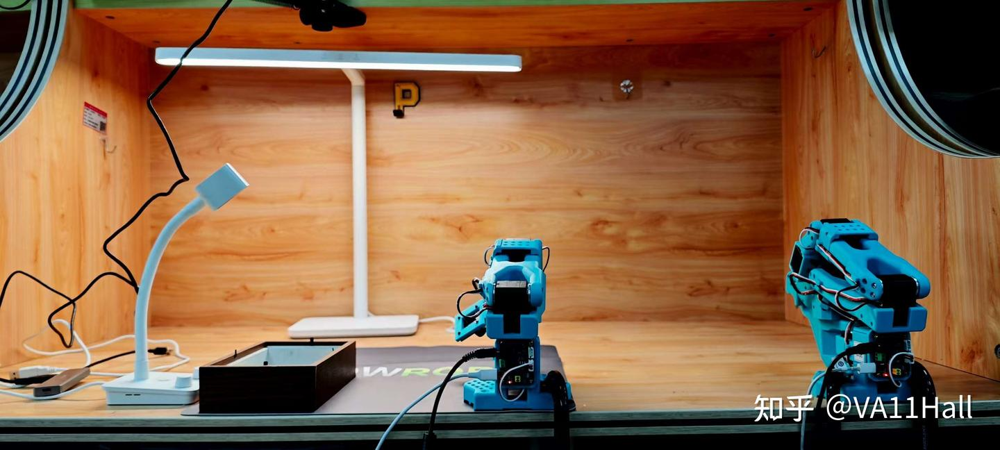
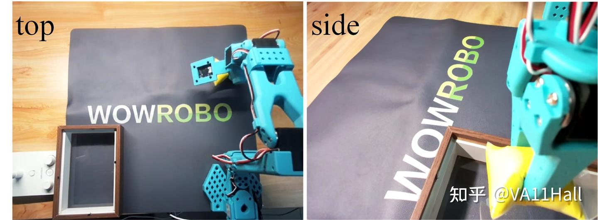

# LeRobot开发笔记

### 一、lerobot硬件介绍

lerobot分为主从臂。

主臂的输入电压为5V，从臂电压为12V，有各自的电源线。

主从臂各配有一根数据线用于连接电脑，采用串口通讯。

本文使用的lerobot型号为[SO-101](https://zhida.zhihu.com/search?content_id=261716767&content_type=Article&match_order=1&q=SO-101&zhida_source=entity)，淘宝直接购买的成品，lerobot完全开源，也可以自行组装。

组装完成的lerobot需要配置电机id，本文购买的成品已经配置好了。

本文本地开发环境为[Ubuntu 18.04](https://zhida.zhihu.com/search?content_id=261716767&content_type=Article&match_order=1&q=Ubuntu+18.04&zhida_source=entity)，使用服务器4090显卡进行训练。

### 二、lerobot库安装

主要参考官方文档：[https://huggingface.co/docs/lerobot/installation](https://link.zhihu.com/?target=https%3A//huggingface.co/docs/lerobot/installation)

（1）需要事先安装好[Anaconda](https://zhida.zhihu.com/search?content_id=261716767&content_type=Article&match_order=1&q=Anaconda&zhida_source=entity)，[Miniconda](https://zhida.zhihu.com/search?content_id=261716767&content_type=Article&match_order=1&q=Miniconda&zhida_source=entity)也可以。然后创建好lerobot环境。

```adl
shell
conda create -y -n lerobot python=3.10
conda activate lerobot
```

（2）安装[ffmpeg](https://zhida.zhihu.com/search?content_id=261716767&content_type=Article&match_order=1&q=ffmpeg&zhida_source=entity)

```text
shell
conda install ffmpeg -c conda-forge
```

（3）安装LeRobot

下载资源包并安装

```text
shell
git clone https://github.com/huggingface/lerobot.git
cd lerobot
pip install -e .
```

不出意外会出现意外，本文开发过程中遇到的问题是提示没有在虚拟环境中安装;

```text
(lerobot) fyh@fyh:~/lerobot$ pip install -e .
Obtaining file:///home/fyh/lerobot
  Installing build dependencies ... done
  Checking if build backend supports build_editable ... done
  Getting requirements to build editable ... done
  Preparing editable metadata (pyproject.toml) ... done
Collecting datasets<=3.6.0,>=2.19.0 (from lerobot==0.3.4)
  Using cached datasets-3.6.0-py3-none-any.whl.metadata (19 kB)
Collecting diffusers>=0.27.2 (from lerobot==0.3.4)
  Using cached diffusers-0.34.0-py3-none-any.whl.metadata (20 kB)
Collecting huggingface-hub>=0.34.2 (from huggingface-hub[cli,hf-transfer]>=0.34.2->lerobot==0.3.4)
  Using cached huggingface_hub-0.34.4-py3-none-any.whl.metadata (14 kB)
Collecting cmake>=3.29.0.1 (from lerobot==0.3.4)
  Using cached cmake-4.1.0-py3-none-manylinux2014_x86_64.manylinux_2_17_x86_64.whl.metadata (6.5 kB)
Collecting einops>=0.8.0 (from lerobot==0.3.4)
  Using cached einops-0.8.1-py3-none-any.whl.metadata (13 kB)
Collecting opencv-python-headless>=4.9.0 (from lerobot==0.3.4)
  Using cached opencv_python_headless-4.12.0.88-cp37-abi3-manylinux2014_x86_64.manylinux_2_17_x86_64.whl.metadata (19 kB)
Collecting av>=14.2.0 (from lerobot==0.3.4)
  Using cached av-15.0.0.tar.gz (3.8 MB)
  Installing build dependencies ... done
  Getting requirements to build wheel ... error
  error: subprocess-exited-with-error
  
  × Getting requirements to build wheel did not run successfully.
  │ exit code: 1
  ╰─> [17 lines of output]
      Traceback (most recent call last):
        File "/home/fyh/anaconda3/envs/lerobot/lib/python3.10/site-packages/pip/_vendor/pyproject_hooks/_in_process/_in_process.py", line 389, in <module>
          main()
        File "/home/fyh/anaconda3/envs/lerobot/lib/python3.10/site-packages/pip/_vendor/pyproject_hooks/_in_process/_in_process.py", line 373, in main
          json_out["return_val"] = hook(**hook_input["kwargs"])
        File "/home/fyh/anaconda3/envs/lerobot/lib/python3.10/site-packages/pip/_vendor/pyproject_hooks/_in_process/_in_process.py", line 143, in get_requires_for_build_wheel
          return hook(config_settings)
        File "/tmp/pip-build-env-xunzng48/overlay/lib/python3.10/site-packages/setuptools/build_meta.py", line 331, in get_requires_for_build_wheel
          return self._get_build_requires(config_settings, requirements=[])
        File "/tmp/pip-build-env-xunzng48/overlay/lib/python3.10/site-packages/setuptools/build_meta.py", line 301, in _get_build_requires
          self.run_setup()
        File "/tmp/pip-build-env-xunzng48/overlay/lib/python3.10/site-packages/setuptools/build_meta.py", line 512, in run_setup
          super().run_setup(setup_script=setup_script)
        File "/tmp/pip-build-env-xunzng48/overlay/lib/python3.10/site-packages/setuptools/build_meta.py", line 317, in run_setup
          exec(code, locals())
        File "<string>", line 21, in <module>
      ValueError: You are not using a virtual environment
      [end of output]
  
  note: This error originates from a subprocess, and is likely not a problem with pip.
error: subprocess-exited-with-error

× Getting requirements to build wheel did not run successfully.
│ exit code: 1
╰─> See above for output.

note: This error originates from a subprocess, and is likely not a problem with pip.
```

一开始只注意到了说是没有在虚拟环境中安装的报错，认为是conda环境的问题，把报错信息复制询问GPT尝试了很多方法但是都无法解决。后来看了完整的终端信息发现是在安装av包的时候（Collecting av>=14.2.0 (from lerobot==0.3.4)）才出现这个问题，所以其实直接单独pip install av后问题就解决了。

随后遇到的问题是找不到[rerun-sdk](https://zhida.zhihu.com/search?content_id=261716767&content_type=Article&match_order=1&q=rerun-sdk&zhida_source=entity)这个包，并且单独pip install也很诡异地没有这个包的信息。最后查询了rerun的官网和GitHub，使用conda install安装了rerun。期间也怀疑过是安装的版本要求不合理导致找不到相应的资源所以修改过lerobot的pyproject.toml，把rerun的版本要求放宽。但不知道这一步是否是必须的，在用conda install rerun-sdk成功安装后，再安装lerobot就没有任何报错了。

官方文档提供了一个报错排查，本文安装过程中并不需要：

```text
sudo apt-get install cmake build-essential python-dev pkg-config libavformat-dev libavcodec-dev libavdevice-dev libavutil-dev libswscale-dev libswresample-dev libavfilter-dev pkg-config
```

### 三、lerobot标定

该部分可以完全参考官方文档：[https://huggingface.co/docs/lerobot/so101。](https://link.zhihu.com/?target=https%3A//huggingface.co/docs/lerobot/so101%E3%80%82)

本文标定过程中没有遇到特殊问题。整个标定过程就是给机械臂确认关节运动范围，标定初始状态似乎并不重要，让机械臂走过完整的关节角度范围即可。

标定的文件会自动保存。

后续主从操控的时候时不时会要求重新标定，按照终端提示再标定一次即可。

标定过程中需要给机械臂取名字，本文标定的指令示例如下：

```text
python -m lerobot.calibrate \
    --robot.type=so101_follower \
    --robot.port=/dev/ttyACM0
    --robot.id=fyh_follower_arm

python -m lerobot.calibrate \
    --teleop.type=so101_leader \
    --teleop.port=/dev/ttyACM1
    --teleop.id=fyh_leader_arm
```

### 四、主从控制

利用lerobot包find_port找对主从臂的串口。

本文使用的控制命令行示例如下：

```text
python -m lerobot.teleoperate \
    --robot.type=so101_follower \
    --robot.port=/dev/ttyACM0 \
    --robot.id=fyh_follower_arm \
    --teleop.type=so101_leader \
    --teleop.port=/dev/ttyACM1 \
    --teleop.id=fyh_leader_arm
```

如果要带摄像头的话可以参考以下指令：

```text
python -m lerobot.teleoperate \
    --robot.type=so101_follower \
    --robot.port=/dev/ttyACM0 \
    --robot.id=fyh_follower_arm \
    --robot.cameras="{ top: {type: opencv, index_or_path: 2, width: 640, height: 480, fps: 30},side: {type: opencv, index_or_path: 4, width: 640, height: 480, fps: 30}}" \
    --teleop.type=so101_leader \
    --teleop.port=/dev/ttyACM1 \
    --teleop.id=fyh_leader_arm \
    --display_data=true
```

本文采取的实验布局为两个摄像头，一个俯拍，一个侧拍，取名为“top”和“side”，相机信息可以用lerobot包找摄像头的程序获取。

特别注意加入可选指令：

```text
shell
    --display_data=true
```

带上这个指令会打开rerun工具（就是前面特别难装的东西），可以看到实时的相机图像和机械臂关节角度的曲线。

### 五、录制数据集

本文的实验平台布局如图所示：



两个摄像头的视角：



本文的操作任务为把桌上的黄色物件放到左下角盒子里。

由于主要的目标是跑通整个流程，所以数据采集较为随意，数据采集方案仅采样了30个episode，首先在一个一般性很高的位置上采集了8个episode，随后再在其他任意位置上采集满30个。

本文使用的数据采集命令示例如下：

```text
python -m lerobot.record \                                                                                                  
    --robot.type=so100_follower \                                                                                           
    --robot.port=/dev/ttyACM1 \                                                                                            
    --robot.cameras="{ top: {type: opencv, index_or_path: 2, width: 640, height: 480, fps: 30},side: {type: opencv, index_or_path: 4, width: 640, height: 480, fps: 30}}" \
    --robot.id=fyh_follower_arm \
    --teleop.type=so100_leader \
    --teleop.port=/dev/ttyACM0 \
    --teleop.id=fyh_leader_arm \
    --display_data=true \
    --dataset.repo_id=fyh/record-test \
    --dataset.num_episodes=2 \
    --dataset.push_to_hub=false \
    --dataset.single_task="Grab the yellow"
```

命令的特殊之处主要是:

```text
--dataset.repo_id=fyh/record-test
--dataset.push_to_hub=false
```

这里根据官方文档需要对应huggingface账号相关的内容，由于暂时用不到，所以自行填写了内容，并且关闭了上传至hub的选项。

录制的数据存储会存储到~/.cache/hugggingface/...。

```text
--dataset.num_episodes=2
```

表示录制2个episode，根据需要选取，官方推荐是录制50个episode，在5个不同位置各录制10条。

录制的时候把电脑声音输出打开，会有提示音，提示目前开始录制第几个episode，录制完一个还会提示reset the environment。

录制过程是全自动的，达到最大录制时间会自动结束某一个episode的录制进入下一步，但是等待时间很久，可以通过键盘→跳过等待时间。

### 六、训练模型

本文在配有4090的服务器上训练。

在服务器上安装lerobot，并把采集的数据传到服务器的~/.cache/hugggingface/...，要和原来的文件目录相同，没有目录需要自己创建好。

训练指令示例：

```text
lerobot-train \
  --dataset.repo_id=fyh/record-test \
  --policy.type=act \
  --output_dir=outputs/train/act_so101_test \
  --job_name=act_so101_test \
  --policy.device=cuda \
  --wandb.enable=false \
  --policy.push_to_hub=false
```

这里要对应好自己取的名字：

```text
--dataset.repo_id=fyh/record-test
```

训练结果会保存在相对路径下，刚开始训练不会生成，训练一段时间后会生成中间模型:

```text
--output_dir=outputs/train/act_so101_test
```

本文使用4090训练30个episode的数据集，耗时大概2h。

### 七、部署模型

这里直接给出运行指令示例：

```text
lerobot-record   --robot.type=so100_follower   --robot.port=/dev/ttyACM3   --robot.cameras="{ top: {type: opencv, index_or_path: 2, width: 640, height: 480, fps: 30},side: {type: opencv, index_or_path: 0, width: 640, height: 480, fps: 30}}"   --robot.id=fyh_follower_arm   --display_data=true   --dataset.repo_id=fyh/eval_so101   --dataset.single_task="Grab the yellow"   --dataset.push_to_hub=false   --policy.path=outputs/train/act_so101_test/checkpoints/last/pretrained_model
```

运行模型用的也是record指令，与原先不同之处在于用policy（训练得到的模型）代替了主臂控制。

相机的代号要和原本数据集完全对应。

特别注意模型导入的命令行选项：

```text
--policy.path=outputs/train/act_so101_test/checkpoints/last/pretrained_model
```

这部分官方文档上的说明已经过期，需要用到的是policy.path选项，随后直接把模型的路径写上去就行。

这里也不需要定义episode个数，正常运行单步运行至中止时按键盘→可以重新开始一次。

本文训练得到的模型实际部署过程中表现还行，对于简单的位置可以稳定抓取，但是对于较难的位置难以抓取。不过虽然抓不到，模型还是会进行反复尝试。同时对于一些较为困难的抓取位置，模型也会采取特殊的抓取方式（明显区别于简单位置的抓取）。 具体可以观看视频：【lerobot模型训练效果展示】 [lerobot模型训练效果展示_哔哩哔哩_bilibili](https://link.zhihu.com/?target=https%3A//www.bilibili.com/video/BV1YSbrzwE2k/%3Fshare_source%3Dcopy_web%26vd_source%3D2efcafa638cf97e688594939fbdc9783)

至此，可以认为跑通了lerobot一个完整的开发流程。