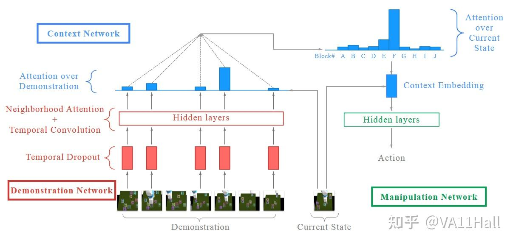
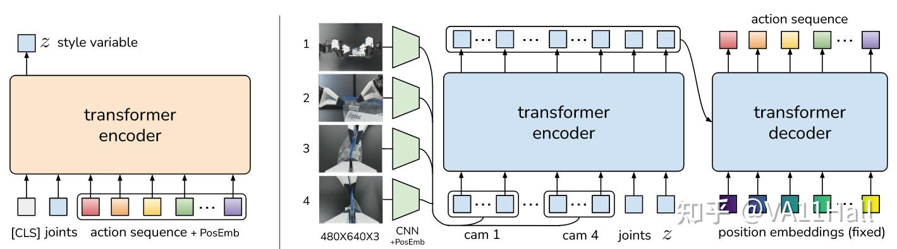

# 从ACT直观理解Transformer在机器人控制上的应用

## 一、引言

本来在学习VLA，花了很多时间去理解[transformer](https://zhida.zhihu.com/search?content_id=262800827&content_type=Article&match_order=1&q=transformer&zhida_source=entity)，囫囵吞枣也仅有一点点理解。后来开始研究lerobot，第一次直接接触transformer架构的机器人控制模型：Architecture of Action Chunking with Transformers (ACT)。这几天阅读了ACT的论文原文Learning Fine-Grained Bimanual Manipulation with Low-Cost Hardware，对于transformer在机器人控制上的应用有了一些实用且直观的理解。

## 二、transformer扮演的角色

回头一想，之前之所以难以理解transformer很大一个原因是没有意识到transformer最初是用于翻译的。transformer一经诞生就带来几个非常新奇的名词：“[自注意力机制](https://zhida.zhihu.com/search?content_id=262800827&content_type=Article&match_order=1&q=自注意力机制&zhida_source=entity)”“[交叉注意力机制](https://zhida.zhihu.com/search?content_id=262800827&content_type=Article&match_order=1&q=交叉注意力机制&zhida_source=entity)”。这些东西对于新手来说不太可能光看论文就看懂，所以我首先看了1brown3blue博主的视频。

但这里陷入了一个不是陷阱的陷阱：1brown3blue讲的是[GPT](https://zhida.zhihu.com/search?content_id=262800827&content_type=Article&match_order=1&q=GPT&zhida_source=entity)，而事实上GPT是不包含交叉注意力机制的。我反复观看视频后逐渐理解了自注意力机制（简单来说自注意力机制就是“理解”），但是交叉注意力机制这个名词我仍然摸不着头脑。但是“交叉注意力机制”却频繁出现在各种论文中，我一度只能将其理解为某种和“注意力机制”本质相同的pro max版本。

transformer相关的入门资料太少，导致相关概念还被束之高阁。事实上，除开从原理上对transformer进行改进，仅仅理解transformer或许不应该这么艰涩。就像[CNN](https://zhida.zhihu.com/search?content_id=262800827&content_type=Article&match_order=1&q=CNN&zhida_source=entity)，其实简单来说它的功能就是“特征提取”，实现的操作是压缩和升维；机器学习往简单来说或许核心就是反向传播、梯度下降。transformer也理应有简单的解释。这就像难道非要像红学家一样才算读过红楼梦吗，我就是磕贾宝玉和林黛玉难道就不算了吗？而且事实上整本书正是按照贾宝玉和林黛玉按这条线索展开的，如果红楼梦只能讲一件事情，曹雪芹肯定会选择贾宝玉和林黛玉的事。

说回正题，理解transformer可能最关键的还是要摆正它所扮演的角色。

在翻译任务中，transformer首先利用自注意力机制理解了原始文本：比如对于“我拿走了一本书”，经过自注意力机制理解，transformer就知道了主体是“我”和“书”，我干的事情是“拿走了”，数目是“一本”。这看似是废话，实则只是因为我们自己来翻译确实就是这么一个理解过程。至于为什么transformer能够理解，是因为它经过大量文本训练，它能够理解了语句中的逻辑，比如主谓宾划分、时间地点人物划分。随后，transformer通过交叉注意力机制将前面理解的东西转换为另一种语言。之所以是“交叉”是因为理解出来的那一团思想的云雾来自于比如说“中文”，但是transformer翻译要输出的比如说是“英文”，两种语言语法不同的，transformer需要“交叉”把中文理解出来的东西对号入座到英文语法下。

对于我们熟悉的GPT，它本质上是一个概率生成过程。对于一句话：“我拿走了一本__”。transformer首先根据自注意力机制知道横线上的东西是要能被“拿”的，然后是“本”为单位的，它从自己的记忆空间中找出最有可能的是“书”这个词。整个过程不存在“交叉”的跨越，所以GPT是仅包含自注意力机制的。

而对于机器人控制，这个过程更接近于一个翻译过程：理解现状、生成动作。transformer首先利用自注意力机制理解自己所处的现状，例如需要抓取的东西在桌子的右上角，夹爪还在桌子左下角上方悬停着；随后transformer利用交叉注意力机制将当前的现状转换为一个动作意图：夹爪向桌子右上角移动。

## 三、模仿学习：机器人的语言

用自然语言与机器人直接沟通交互是一个非常理想的方式，但是对于机器人而言更加直接的方式是模仿学习（我目前还是新手，还没怎么了解过自然语言与机器人交互的论文，但我觉得模仿学习是最自然的一种人机交互方式）。

早在2017年（和attention is all you need同一年），模仿学习领域就诞生过一篇名为[One-shot imitation learning](https://zhida.zhihu.com/search?content_id=262800827&content_type=Article&match_order=1&q=One-shot+imitation+learning&zhida_source=entity)的文章（后面都用One-shot一词指代）。这篇文章提到动作示范是人机交互的一种直接方式。该文章使用到一种名为neighbor attention（[临近注意力机制](https://zhida.zhihu.com/search?content_id=262800827&content_type=Article&match_order=1&q=临近注意力机制&zhida_source=entity)）的注意力机制对动作示范中传达的信息进行“理解”，并将理解的产物交给操作模块输出动作。这篇文章具有非常超前的视野，因为事实上ACT的实现思路和One-shot的大差不差，区别在于One-shot自行定义和实现了具体的注意力、卷积模块，而ACT直接基于transformer架构实现，我个人觉得One-shot不啻为注意力机制在机器人控制中的一篇开山之作。

One-shot的独创性在于它可以通过仅一次的演示，就可以让机器人领会演示背后的那一整类任务。比如操作者演示一次把方块堆叠成两座塔，后续无论桌面上初始方块如何摆放，机器人都能完成堆叠两座塔的任务。而之所以One-shot能够得到如此的效果，其原因在于它使用到了临近注意力机制（从现在来看近似为transformer的自注意力机制），临近注意力机制可以学习到每个方块的颜色、字母以及相互之间的空间位置关系，这其实就是一个理解的过程，并且类似于在自然语言中理解主谓宾的过程。有了临近注意力机制，意味着机器人不再只是对动作演示进行克隆，而是能够领会到动作序列背后的意图。这样当一个新的动作演示输入时，机器人就可以通过解释其中的意图，生成与意图相应的新的动作流程。

One-shot的成功说明了“理解”对于机器人操作的重要性。以往限制模仿学习的其实就是“理解”，以往模仿学习基于的“理解”是奖励函数，机器人基于复现的奖励函数进行决策。而注意力机制的引入，使得理解成为语义上的理解，是一种接近于人类思考方式的更高层次的“理解”。

ps自注意力机制的出现其实淘汰了原本强化学习中“奖励函数”的概念，但是在很多文章中，依然会使用传统强化学习中的表达对问题进行数学建模。感觉未来基于语义理解的策略生成会成为主流。

## 四、ACT的继承

根据前面的铺垫，该部分我们直观理解一下ACT到底做了哪些事情。

首先，ACT会有一个transformer编码器，用于从示范的数据中“理解”得到一个[风格变量](https://zhida.zhihu.com/search?content_id=262800827&content_type=Article&match_order=1&q=风格变量&zhida_source=entity)z。我理解的风格变量应该类似于one-shot网络架构中可视化的那种直方图，描述了示范动作的分布特点。需要特别注意的是z仅仅是描述动作风格，并不是对示范任务的完整表征，因为z的生成并不包含图像信息，仅仅包含了动作取向。我感觉z可能类似于书法中的风格，至于写什么字，什么笔画它并不包含。z可能是为了告诉网络示教动作具有一定的随机性，因此训练得到的模型会有一定的自由性。

随后，z连同相机图像、关节角度一起输入另一个transformer编码器。这里的相机图像分别来自两个夹爪末端，工作台正视图、俯视图，经由CNN处理后输入。经过编码器中自注意力机制处理，ACT可以获得对当前运行情况的理解。

接下来，通过transformer解码器利用交叉注意力机制对着前面这一团理解的云朵，“交叉”生成动作序列。这里有一个很特别的东西：[固定动作嵌入](https://zhida.zhihu.com/search?content_id=262800827&content_type=Article&match_order=1&q=固定动作嵌入&zhida_source=entity)，这个东西规定了生成的动作序列步数，相当于占位符。

至此其实已经走完了整个ACT框架的流程。ACT带来了一种可以说非常简约巧妙的机器人+transformer的范式。这种范式简单来说就是：首先理解情况，随后根据理解生成动作。transformer的自注意力机制赋予了整个架构所需的理解能力，而交叉注意力机制提供了解读转化为实际动作的能力。此外，准确的理解以及解读的结果源自于按照模仿学习思路采集到的操作示范数据。一句话来说就是：transformer赋予理解能力，模仿学习指定任务。

## 五、ACT的发展

可以认为ACT与One-shot具有异曲同工之妙，ACT主体继承了以前相关工作的研究成果。但是ACT之所以能够在诸多相关模型中脱颖而出，还凭借着它独有的开创性设计：action chunk（动作块）。

对于大行成功的GPT，语言的生成是一个字一个字生成的。直接使用transformer生成动作理论上应该也是一步一步生成的，但是ACT采取的策略是生成动作块，一次生成一个动作序列，并后续在时间维度上对重复的动作步进行融合。这样生成的动作更加流畅，并且能够明显减弱模仿学习中误差累积的问题，以及强化学习中马尔科夫链无法理解演示中单步停顿动作的问题。

事实上，我觉得动作块的概念非常接近于人类的自然思维。当我们要做一件事情，往往是想到一整套动作。这就好像我们聊天一般是一个字一个字敲，但是打游戏的时候一般用的是连招。我觉得ACT里提出的动作块的概念还是比较初级的，这方面或许值得更加深入的研究。

## 写在最后

本人才疏学浅，文中观点和理解想必存在着很多纰漏，欢迎大家不吝指正。