# 结合注意力机制的模仿学习

这周组会打算分享[注意力机制](https://zhida.zhihu.com/search?content_id=262892094&content_type=Article&match_order=1&q=注意力机制&zhida_source=entity)在模仿学习中的应用，主要是粗陋地解读了两篇文章：[One-shot](https://zhida.zhihu.com/search?content_id=262892094&content_type=Article&match_order=1&q=One-shot&zhida_source=entity)和ACT。

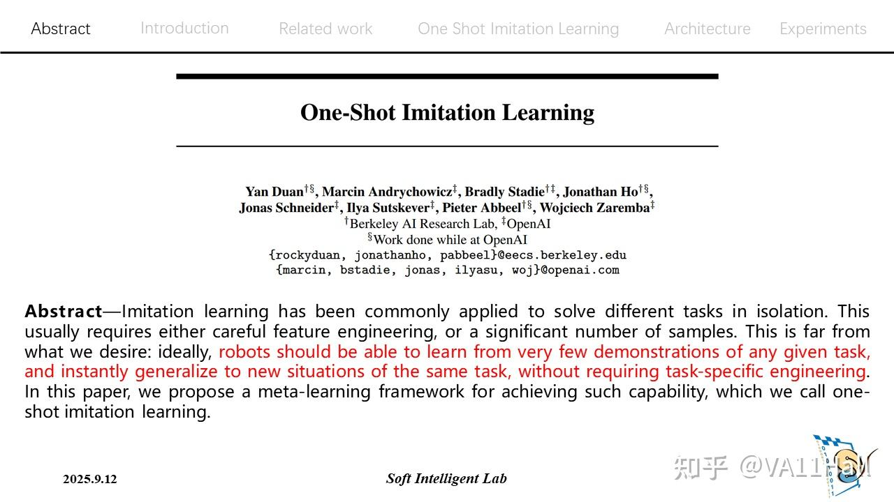

首先是第一篇文章One-shot Imitation Learning，这是一篇于2017年发表的[OpenAI实验室](https://zhida.zhihu.com/search?content_id=262892094&content_type=Article&match_order=1&q=OpenAI实验室&zhida_source=entity)的一项工作。

这篇文章提出了一种只需要少量甚至只需一次的演示就能泛化到新场景的模仿学习网络框架。

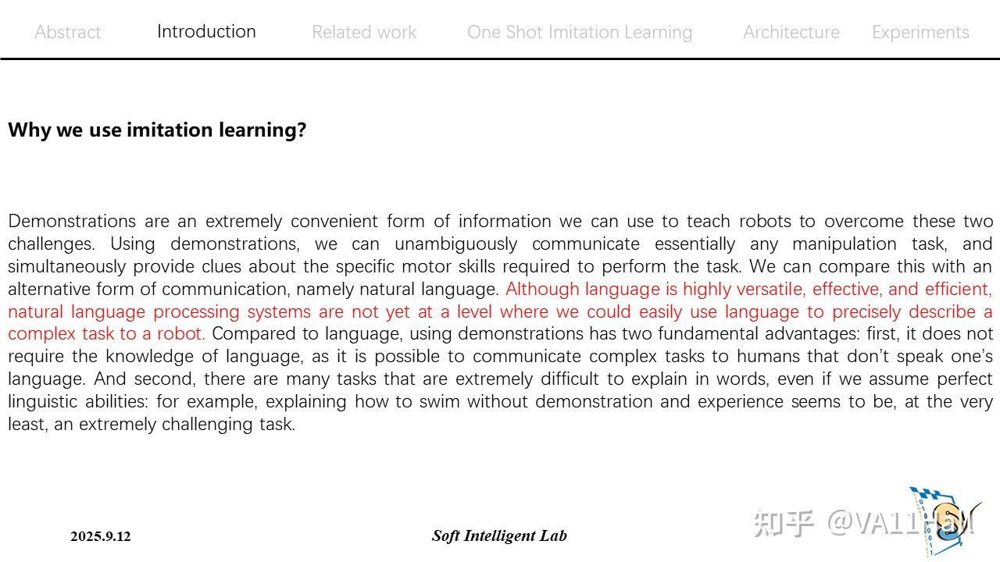

为什么我们需要模仿学习？

在VLA如日中天的当下，language似乎是机器人控制的最优解。

但是我一直有个疑问就是语言对于机器人控制是否是必要的，language应该是技术核心还是说附加项目。

我其实还没怎么学习language相关的东西，只知道language在VLA中扮演着“理解”的角色，但是“理解”的产物一定就是语言吗？

动物也可以“理解”，但是动物没有语言。退一万步，如果我们能得到一个和小狗智能程度类似的智能体，是否就说明具身智能已经成为现实。

但是小狗是不需要语言进行沟通的。

另一个疑问是没有模仿学习，哪来自然语言控制。如果仅靠语言指令是很难“教会”人动作的，我没听说过谁看看书或者看看电视就会打球了。

看电视其实我觉得是一个典型的VLM，如果人类自己都不可能通过大量观看电视学会某项运动，如何指望机器人学会？

所以One-shot这篇提出于2017年的文章就明确说，语言是无法正确描述任务的，和机器人最直接的交流方式是直接示范。

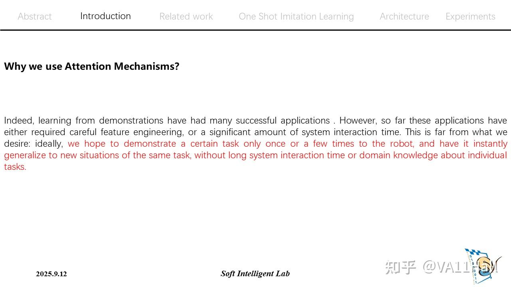

文章还解释了为何需要使用注意力机制。

原因就是只有使用了注意力机制机器人的泛化能力才能有质的提升。

否则就需要喂大量的数据，或者人工精心设计奖励函数等。

我觉得VLA能够有惊人的泛化能力，本质是因为引入了注意力机制。

[transformer](https://zhida.zhihu.com/search?content_id=262892094&content_type=Article&match_order=1&q=transformer&zhida_source=entity)包含了获得“理解”能力所需的注意力机制，正好基于transformer的language属于是狗仗人势了。

有transformer就够了，甚至有注意力机制就够了，有没有language根本无所谓。

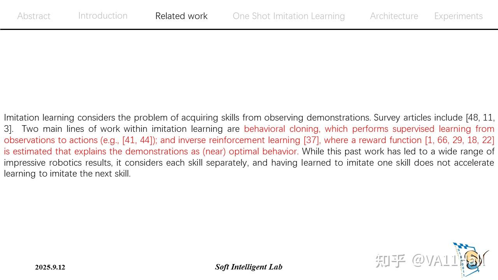

在One-shot之前的模仿学习，主要是[行为克隆](https://zhida.zhihu.com/search?content_id=262892094&content_type=Article&match_order=1&q=行为克隆&zhida_source=entity)和基于逆强化学习。

行为克隆利用监督学习，克隆示范动作，行为克隆需要大量的示范数据，并且迁移能力会很差。

逆强化学习是通过估计奖励函数来实现的，同样需要大量的示范数据，并且无法高效迁移。

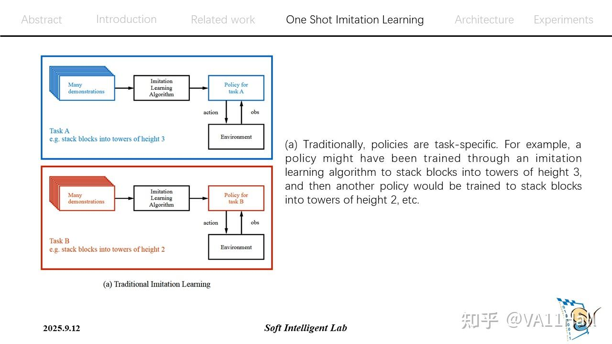

传统的模仿学习方法如上图所示，它们训练的产物往往只能针对某个特定任务，任务稍有变动就需要重新训练。

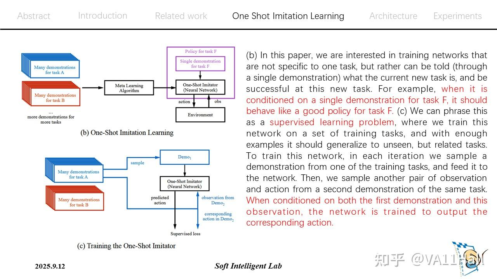

而One shot做到的效果就是可以根据新提供的示范了解新的任务要求，并生成能够完成新任务的policy。

One shot具有很好的泛化能力的原因是它并不直接学习如何完成一个任务，而是学习如何学习某个任务。

它的训练方式是首先提供一个Demo1给他示范，随后提供一个Demo2利用监督学习进行训练。

这个过程类似于老师先讲一道例题，然后让学生做一道练习题并改错。

学生将从这个过程中学会提取老师讲解例题背后的潜在逻辑，利用这个逻辑生成策略，而不是机械模仿。

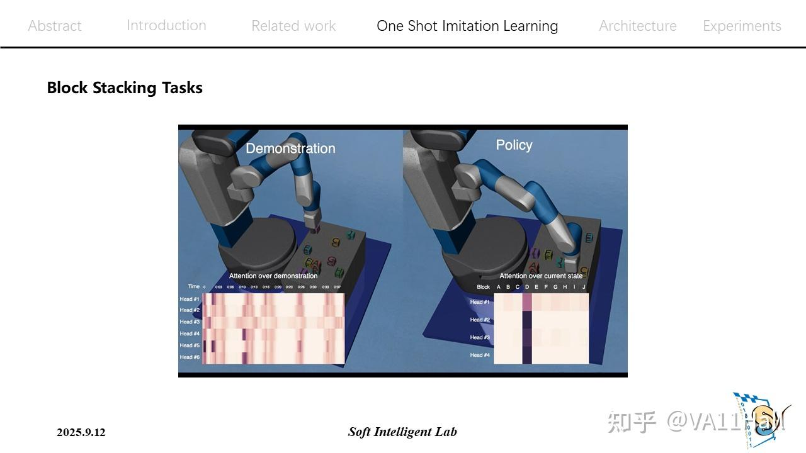

One-shot的演示任务是堆方块。它不是那种随便什么任务都只要示范一次的逆天模型，“仅需示范一次”是对于堆方块这个任务。

只需示范一次，One-shot就可以知道应该怎么堆放。

比如示范一次堆两座塔，后面即便桌面上方块位置全部打乱，One-shot也能按照示范的次序摆放出两座塔。

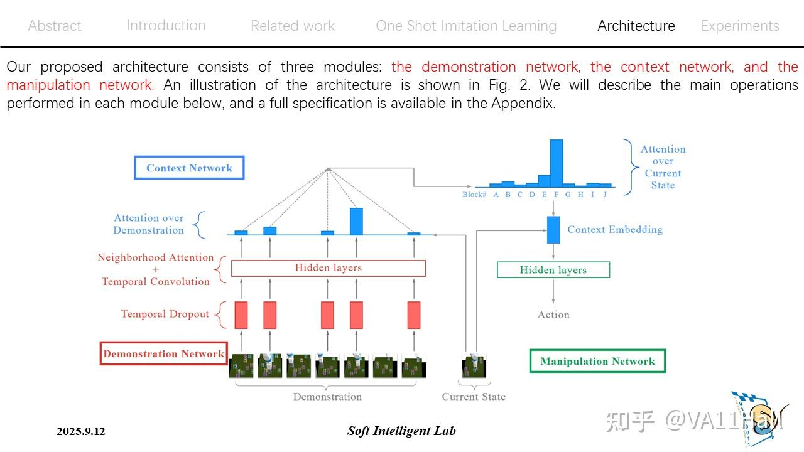

One-shot的网络架构包含三部分，示范网络、情景网络、操作网络。

示范网络是通过注意力机制理解示范，随后传递给情景网络；

情景网络中进一步使用注意力机制，结合当前的状态，生成情景嵌入；

情景嵌入传递给操作网络，输出最后的动作。

整个网络架构神似编码-解码的transformer架构。

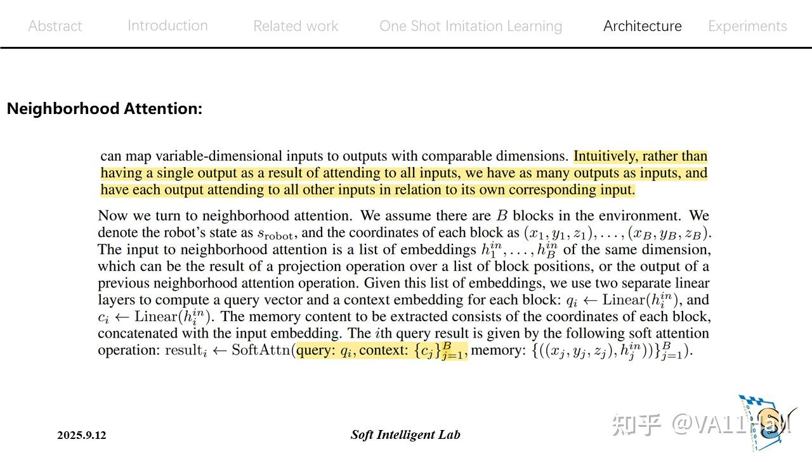

One-shot没有提出自注意力机制，而是提出了一种叫做临近注意力机制的东西。

但是根据描述，它使用到的注意力机制几乎等同于自注意力机制。

首先它注意力机制施加的对象是每一个需要操作的方块，它为每个方块都生成一个所谓的输出，类似transformer对每一个token都做一个输出。

然后它也使用query对生成的输出进行“理解”。（ACT的token是关节状态和图像，映射到同一维度，没有使用交叉注意力机制）

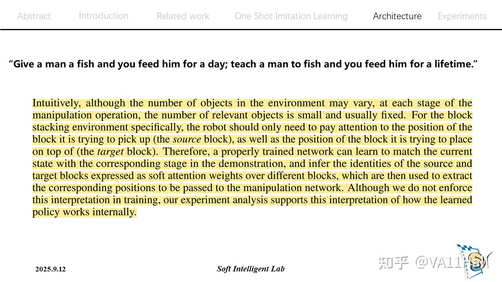

One-shot的思路其实就是授人以鱼不如授人以渔。

One-shot利用注意力机制“理解”任务，然后根据理解生成动作，而非机械克隆策略。

原文就说直观来看，尽管环境中的物体数量可能会变化，但在操作任务的每个阶段，相关的物体数量都很少，而且通常是固定的。以积木堆叠环境为例，机器人只需要关注它要拾取的积木（源积木）的位置，以及它要放置到上面的积木（目标积木）的位置。因此，一个经过充分训练的网络可以学会将当前状态与示范中的对应阶段匹配起来，并通过对不同积木施加的软注意力权重来推断源积木和目标积木的身份，然后提取相应的位置传递给操作网络。虽然在训练过程中我们并没有强制这种解释，但我们的实验分析支持这种对已学习策略内部工作机制的理解。

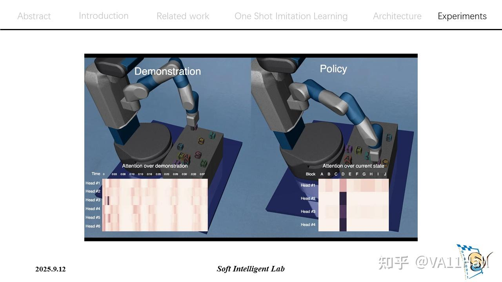

以上是One-shot的实验效果展示，可视化注意力后可以发现policy具有和演示类似的一个注意力分布。

这说明，One-shot可以利用注意力机制有效学习到演示背后的一个深层逻辑。

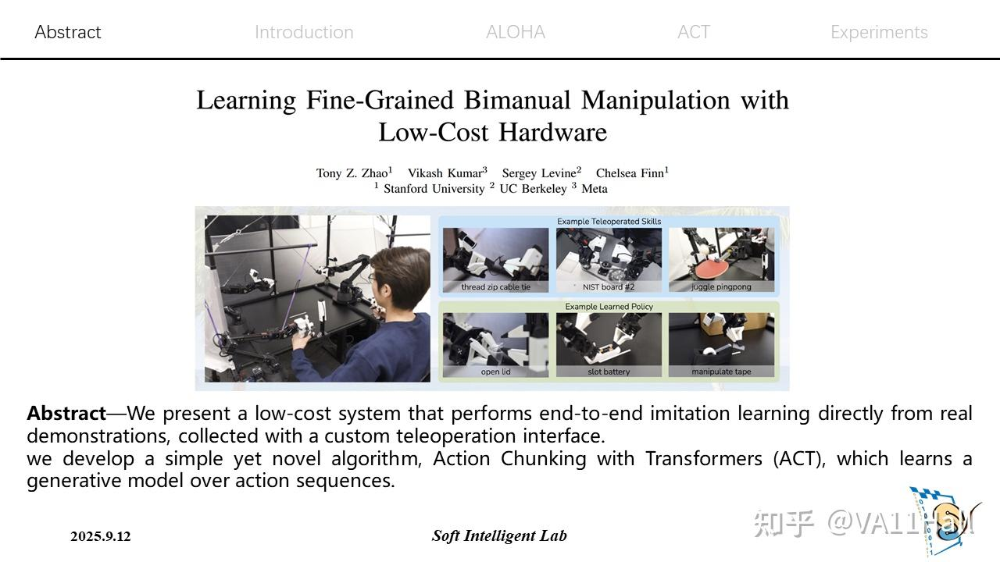

第二篇文章是于2023年发表的ACT。

这篇文章提出了[ALOHA平台](https://zhida.zhihu.com/search?content_id=262892094&content_type=Article&match_order=1&q=ALOHA平台&zhida_source=entity)的搭建方法，以及一个机器人操作模型ACT。

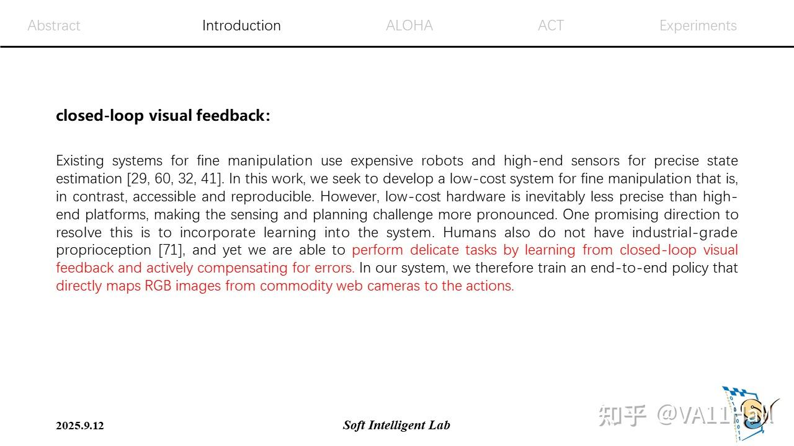

这篇文章的切入角度是“低成本”“高精度”

它的灵感似乎和传统的视觉伺服异曲同工

它希望通过视觉补偿来提高操作精度，这样不需要非常高的硬件水平就可以实现高精度操作。

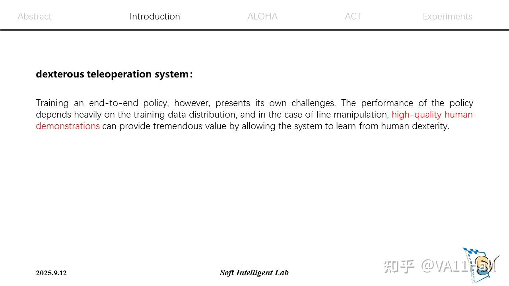

为了实现高精度操作，需要高质量的人类示范

文章设计了一个灵巧遥操作系统，也就是ALOHA

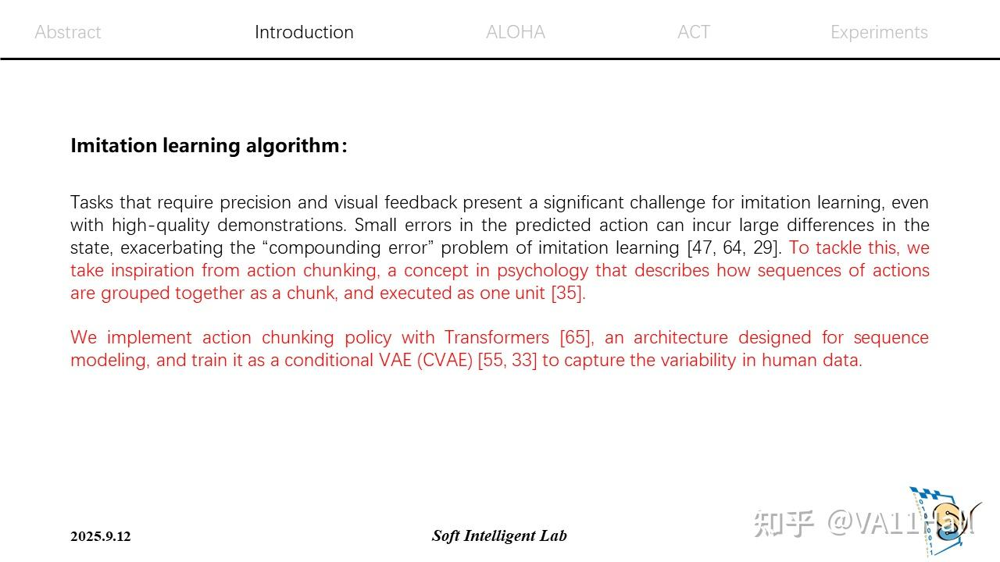

然后就是这篇文章也对行为克隆、逆强化学习这些模仿学习方法进行了局限性分析，然后提出使用transformer来生成动作序列。

并且它强调生成的是动作序列，而不是单个动作。

这和GPT一个词一个词生成的方式不一样。

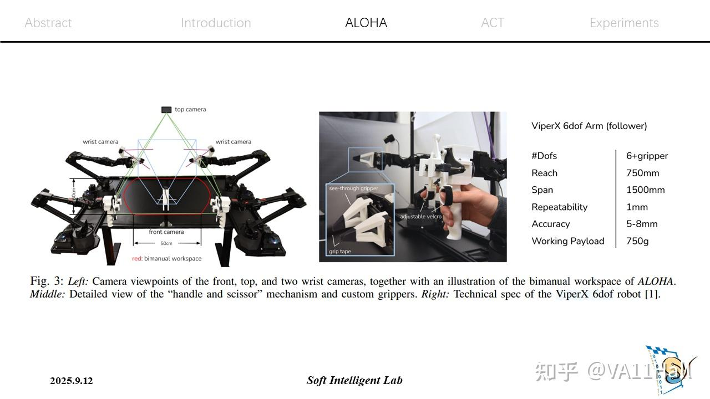

文章介绍了ALOHA的系统设计，包括相机位置，夹爪设计，硬件参数

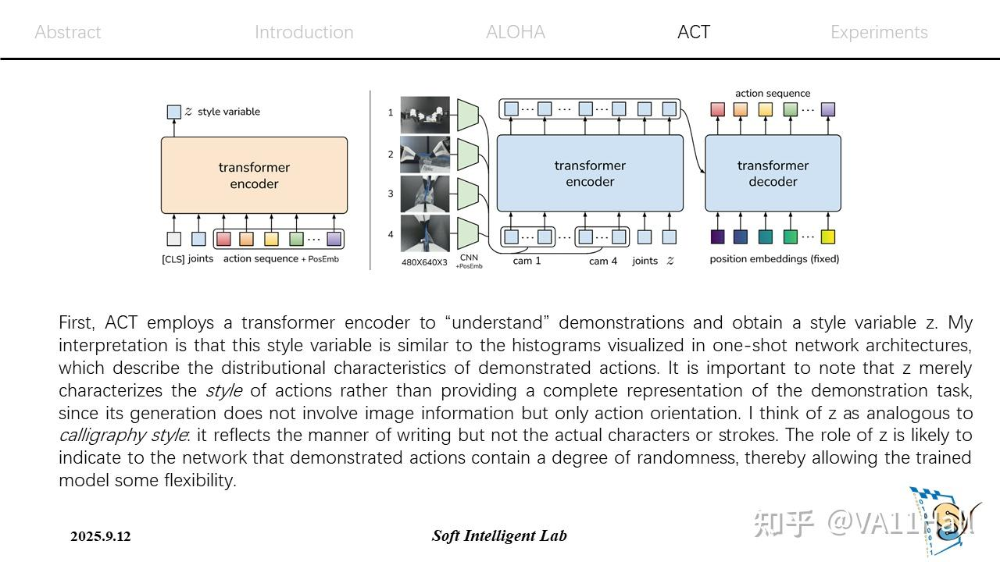

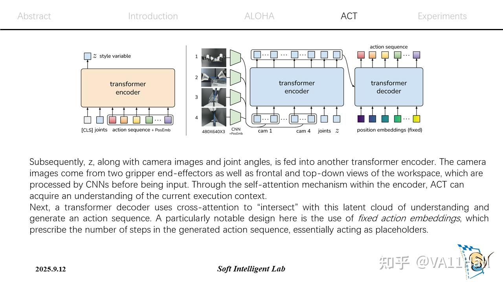

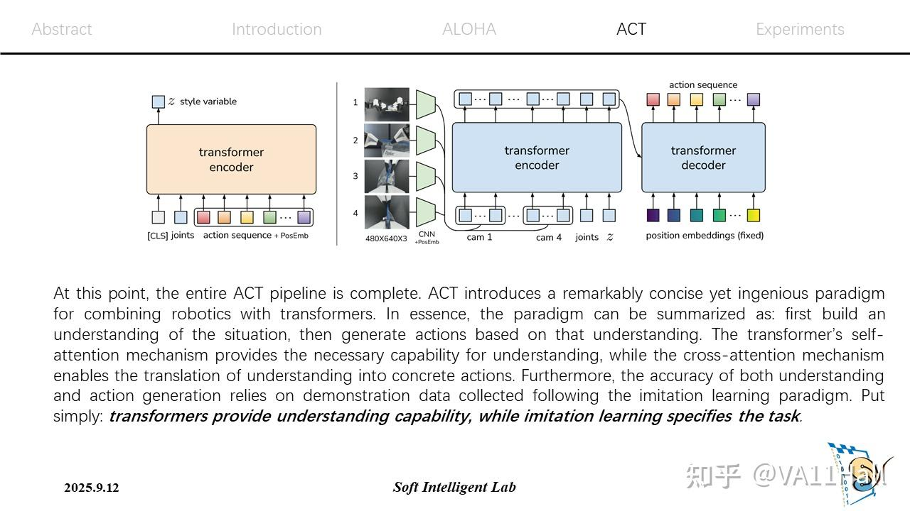

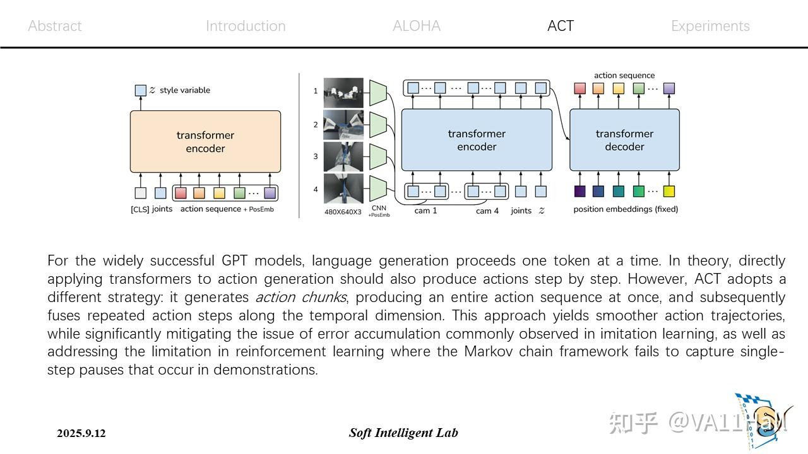

ACT的架构介绍全部中翻英自我自己的博客[从ACT直观理解Transformer在机器人控制上的应用](https://zhuanlan.zhihu.com/p/1948410226328974605)

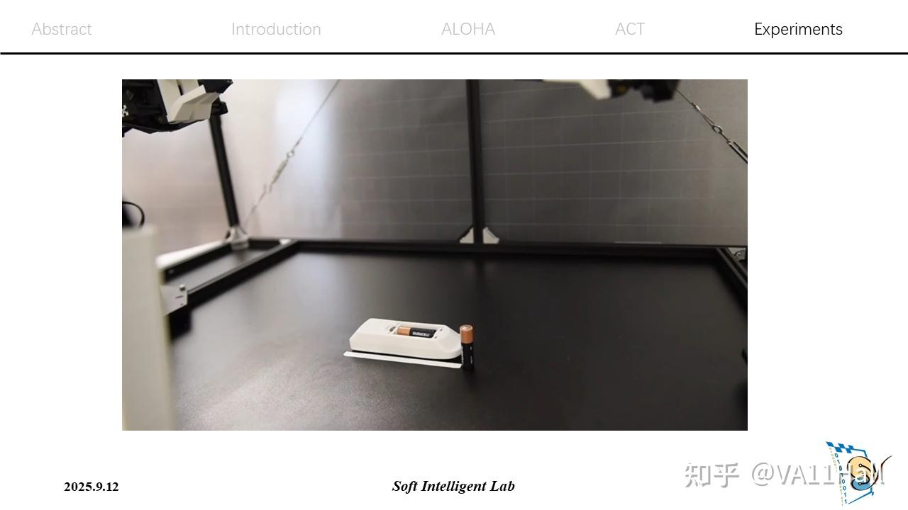

以上是ACT的实验展示，效果非常好。

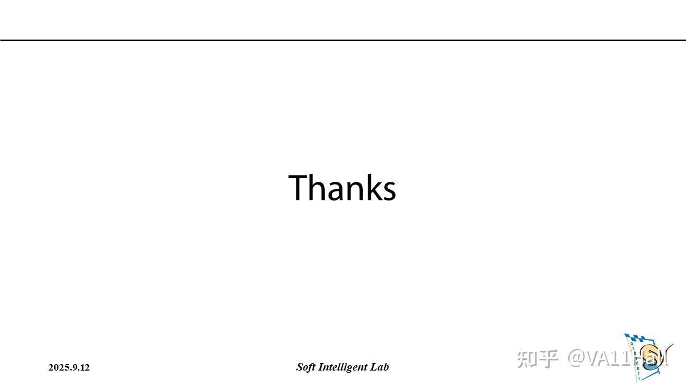